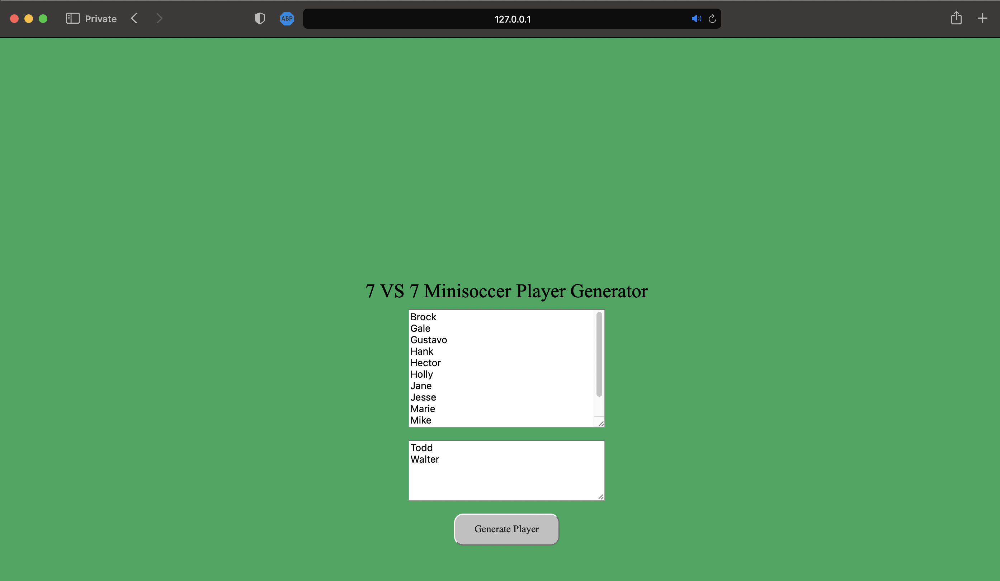
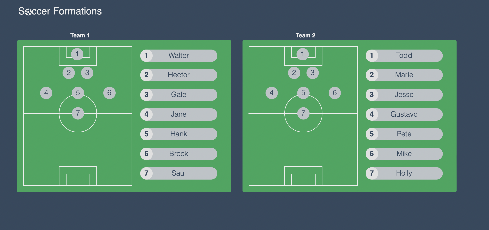

# 7 VS 7 Player Minisoccer Generator
Because i like to playing football. This application is designed to randomize players for 7 vs 7 mini-soccer. What sets it apart from other random generators on the internet is that it is specifically created to randomly select 7 vs 7 football players and goalkeepers separately. Thus, during the randomization process, one team won't end up with two goalkeepers. which is could solving my own problem when im trying to randomize player for mini-soccer game.

How to run this app on your local machine:
1. Clone this repository
2. create virtual env
3. inside virtual env, install depedencies using `pip install -r requirements.txt`
4. run the app using `python app.py`

or you can accsess thru this link: http://7vs7generator.pythonanywhere.com

## Player Form

Credit to [Jonathan Pier for formations UI](https://codepen.io/JonathanPier/pen/JGRpBJ)
## Random Formations
